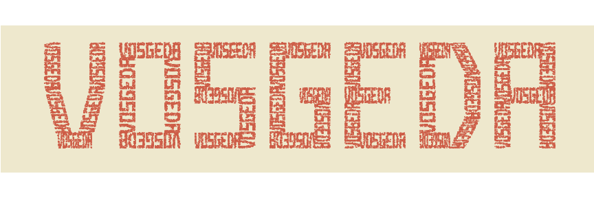

# FractalText

Print any word as a fractal

Interactive web app: <https://ismaelsb.shinyapps.io/FractalText>

Code available here: <https://github.com/ismaelsb/FractalText>


```r
textmatrix <- function (word) {
  
  #assembles the blocks for every character in a word
  
  word <- gsub("[[:digit:]]+","",word) #remove digits
  word <- gsub("[ ]{2,}"," ",word) #remove all spaces but the first in a row
  
  M=matrix(0,0,6) #empty matrix with 6 columns
  K <- 0 #accumulated kerring
  m <- 0 #accumulated rows
  
  if (word != "") {
  
    for (i in 1:nchar(word)){
    
      C <- charmatrix(substr(word, i, i))
      C <- C + 5*(i-1) * rep(1,dim(C)[1]) %*% matrix(c(1,0,0,0,0,0),1,6)
      M <- rbind(M,C)
      
      if (substr(word, i, i) == "l" | substr(word, i, i) == "L") {
        
        K <- K + 0.7
        M <- M + 0.7 * rep(1,dim(M)[1]) %*% matrix(c(1,0,0,0,0,0),1,6)
        
      }
      
      else if (substr(word, i, i) == "f" | substr(word, i, i) == "F") {
        
        K <- K + 0.4
        M <- M + 0.4 * rep(1,dim(M)[1]) %*% matrix(c(1,0,0,0,0,0),1,6)
        
      }
      
      else if (m>0 & (substr(word, i, i) == "j" | substr(word, i, i) == "J")) {
        
        K <- K + 0.3
        M[1:m,] <- M[1:m,] + 0.3 * rep(1,m) %*% matrix(c(1,0,0,0,0,0),1,6)
        
      }
      
      else if (substr(word, i, i) == "t" | substr(word, i, i) == "T") {
        
        K <- K + 0.2
        M <- M + 0.2 * rep(1,dim(M)[1]) %*% matrix(c(1,0,0,0,0,0),1,6)
        
        if (m>0){
          
          K <- K + 0.2
          M[1:m,] <- M[1:m,] + 0.2 * rep(1,m) %*% matrix(c(1,0,0,0,0,0),1,6)
          
          }
        
      }
      
      m <- dim(M)[1] #accumulated rows before the next character
      
    }
    
    #reajust to left margin by substracting the accumulated kerring
    M <- M - K * rep(1,dim(M)[1]) %*% matrix(c(1,0,0,0,0,0),1,6)
    
  }
  
  return(list(M,K))
  
}
```


```r
fractaltext <- function(word, dots, iter) {
  
  word <- gsub("[[:digit:]]+","",word) #remove digits
  word <- gsub("[ ]{2,}"," ",word) #remove all spaces but the first in a row
  
  if (word == "" | word == " ") {
    
    fractal <- as.data.frame(matrix(NA,0,2))
    names(fractal) <- c("x","y")
    return(fractal)
    
  }
  
  textlist <- textmatrix(word)
  D <- textlist[[1]] #textmatrix
  K <- textlist[[2]] #kerring
  
  nblock=dim(D)[1] #number of blocks
  
  a <- nchar(word)*(4+1)-1-K #character width = 4
  b <- 7 #character height =7
  
  S=matrix(c(1/a,0,0,1/b),2,2) #normalization
  W=matrix(c(a,0,0,b),2,2) #denormalization
  
  blockareas <- prop.table(apply(matrix(1:nblock) ,1 ,blockarea, D))
  
  fractal <- matrix(NA,dots,2)
  
  for (d in 1:dots){
    
    p <- matrix(runif(2),2,1)
    
    for (i in 1:iter){
      
      block <- sample(1:nblock, 1, replace = T, prob = blockareas) 
      
      L <- matrix(D[block,3:6],2,2) #linear deformation matrix
      O <- matrix(D[block,1:2],2,1) #translation vector
      
      p <- L %*% p + O
      
      p <- S %*% p #normalization
      
    }
    
    p <- W %*% p #denormalization
    
    fractal[d,] <- p
    
    
  }
  
  fractal <- as.data.frame(fractal)
  names(fractal) <- c("x","y")
  return(fractal)
  
}
```


```r
blockarea <- function (block, D) abs(det(matrix(D[block,3:6],2,2)))
```

See also the code for character matrices in the link above


```r
plotfractaltext <- function(word, dots=30000, iter=3, textcolor='coral3', backcolor='cornsilk2', dotsize=.5, computed=F) {
  
  #word can be: or a string of characters or the return of function 'fractaltext'.
  #In the last case, specify with the argument computed=TRUE
  #this is done in order to avoid recalculations when you just want to change the plot
  
  if (computed==F) fractal <- fractaltext(word, dots, iter) #compute and then plot
  else fractal <- word #then just plot:

  ggplot(fractal, aes(x=x, y=y)) +
    geom_point(size=dotsize,alpha=0.5, color=textcolor) + coord_fixed() +
    guides(fill=FALSE) + 
    theme(panel.grid.major = element_blank(), panel.grid.minor = element_blank())+
    theme(panel.background = element_rect(fill = backcolor))+
    theme(plot.background  = element_rect(fill = backcolor))+
    theme(axis.text.x=element_blank(), axis.text.y=element_blank(),
          axis.title.x=element_blank(), axis.title.y=element_blank(),
          axis.ticks=element_blank())

}
```


```r
#compute and then plot
plotfractaltext("vosgeda",40000,4)
```

 

```r
#compute
#fractal <- fractaltext("vosgeda",40000,4)
#then just plot
#plotfractaltext(fractal, computed=T)
```

